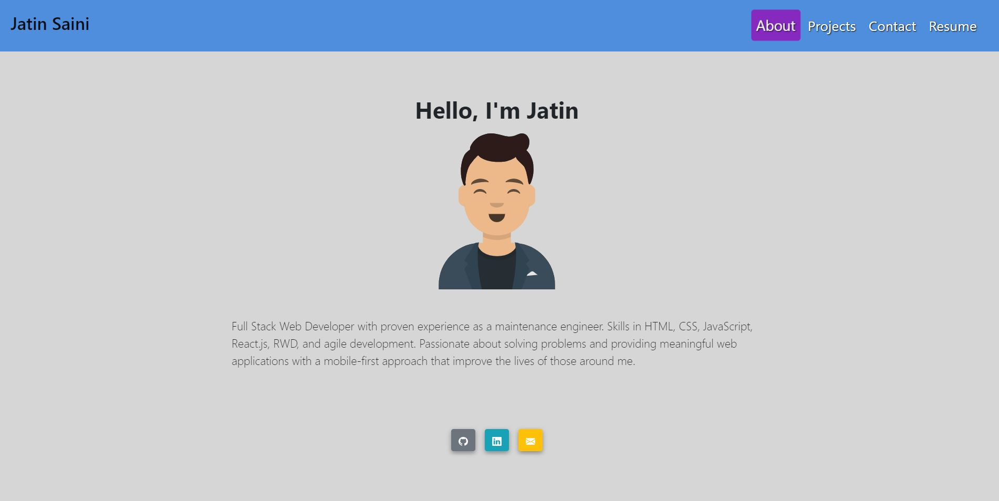

# React portfolio
Jatin's react portfolio with the technologies mentioned below.

## Description
A professional portfolio to showcase user skills, projects, resume and contact information.

## Table of Contents
* [Installation](#installation)
* [Contribution](#contribution)
* [Features](#features)
* [Questions](#questions)
* [Screenshot](#screenshot)
* [Deployed Site](#deployed-site)

## Installation
Please download the following packages:

* "react": "^18.2.0",
* "react-dom": "^18.2.0",
* "react-scripts": "5.0.1",
* "web-vitals": "^2.1.4",
* "@fontsource/roboto": "^4.4.5",
* "react-bootstrap": "^1.6.1",
* "avataaars": "^1.2.2",
* "bootstrap": "^4.6.0",
* "emailjs-com": "^3.2.0"

## Contribution

jatin1211: https://github.com/jatin1211

## Features
* Node.js
* React.js
* JSX
* Javascript
* Avataars
* Bootstrap

## Questions?
Please email me with questions!
* sainijatin247@gmail.com

## Screenshot

## Deployed Site
http://jatin1211.github.io/Jatin-React-Portfolio
